# Fireblocks-CPN Integration Sequence Diagrams

## 1. Complete Cross-Border Payment Flow

This diagram shows the end-to-end process from payment initiation to final settlement, highlighting the interaction between Fireblocks custody and CPN network.

## 2. Liquidity Management & Vault Operations

This diagram shows how the system manages USDC liquidity across multiple Fireblocks vaults for optimal CPN operations.

```mermaid
sequenceDiagram
    participant Admin as Admin Dashboard
    participant LM as Liquidity Manager
    participant API as Management API
    participant FB as Fireblocks Service
    participant FBNet as Fireblocks Network
    participant CPN as CPN Service
    participant Alert as Alert System

    autonumber
    Note over Admin,Alert: Automated Liquidity Monitoring

    loop Every 5 minutes
        LM->>FB: getAllCPNVaultBalances()
        FB->>FBNet: GET /v1/vault/accounts (CPN vaults)
        FBNet-->>FB: [{ id: "vault_main", balance: "50000" }, { id: "vault_settlement", balance: "5000" }]
        FB-->>LM: Aggregate liquidity data
        LM->>LM: Calculate total available USDC
        LM->>CPN: updateAvailableLiquidity(totalUSDC)
        CPN->>CPN: Adjust quote generation limits

        alt Low Liquidity Warning (< $10,000)
            LM->>Alert: triggerLowLiquidityAlert()
            Alert->>Admin: 🚨 Low USDC liquidity warning
        else Critical Liquidity (< $5,000)
            LM->>Alert: triggerCriticalAlert()
            Alert->>Admin: 🔴 CRITICAL: Suspend new payments
            LM->>CPN: suspendQuoteGeneration()
        end
    end

    Note over Admin,Alert: Manual Liquidity Rebalancing

    Admin->>API: Request vault rebalancing
    API->>FB: getVaultBalances([vault_ids])
    FB-->>API: Current distribution
    API->>Admin: Show options
    Admin->>API: Approve transfer (vault_main to vault_settlement, $20,000)
    API->>FB: transferUSDC(fromVaultId, toVaultId, amount)
    FB->>FBNet: POST /v1/transactions (internal transfer)
    FBNet->>FBNet: Internal vault transfer (instant)
    FBNet-->>FB: Transfer completed
    FB-->>API: Rebalancing successful
    API->>LM: triggerBalanceRefresh()
    LM->>CPN: updateAvailableLiquidity(newTotal)
    API-->>Admin: ✅ Liquidity rebalanced

    Note over Admin,Alert: Automated Replenishment

    alt Integration with Circle Mint API
        LM->>API: requestUSDCMinting($100,000)
        API->>API: Initiate wire transfer to Circle
        API->>API: Await mint confirmation
        API->>FB: createVaultWallet(mainVault, "USDC_ETH_TEST5_AN74")
        FB-->>API: New vault address
        API-->>LM: Replenishment initiated
    end
```

## 3. Webhook Coordination & Real-time Updates

This diagram illustrates how Fireblocks webhooks coordinate with CPN status updates to provide real-time payment tracking.

## 4. Compliance & Travel Rule Integration

This diagram shows how the system handles regulatory compliance requirements through the CPN network while maintaining Fireblocks custody.

## Key Integration Points Explained

### 1. **Fireblocks as Custody Layer**
- **Vault Management**: Each CPN operation uses dedicated Fireblocks vaults for USDC custody
- **MPC Signing**: All blockchain transactions are signed using Fireblocks' MPC technology
- **Balance Monitoring**: Real-time USDC balance checks before quote generation
- **Settlement Execution**: Fireblocks handles the actual blockchain settlement

### 2. **CPN as Network Orchestration**
- **BFI Discovery**: Finds optimal beneficiary financial institutions
- **Quote Aggregation**: Collects competitive rates from multiple BFIs
- **Compliance Automation**: Handles AML/sanctions screening and Travel Rule compliance
- **Settlement Coordination**: Manages the end-to-end payment lifecycle

### 3. **Webhook Coordination**
- **Status Synchronization**: Fireblocks webhooks update CPN transaction status
- **Real-time Updates**: Users receive live payment progress notifications
- **Error Handling**: Failed transactions trigger appropriate recovery mechanisms
- **Compliance Reporting**: Automated regulatory reporting throughout the process

### 4. **Liquidity Management**
- **Multi-Vault Strategy**: Separate vaults for different operational purposes
- **Automated Monitoring**: Continuous balance checking and rebalancing
- **Alert Systems**: Proactive notifications for low liquidity conditions
- **Integration Ready**: Prepared for Circle Mint API integration for USDC replenishment

This architecture ensures that Fireblocks provides enterprise-grade custody while CPN enables global reach and regulatory compliance for cross-border payments.
